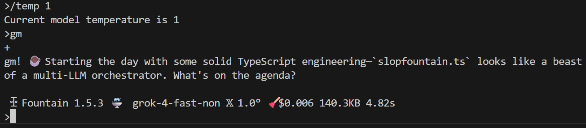
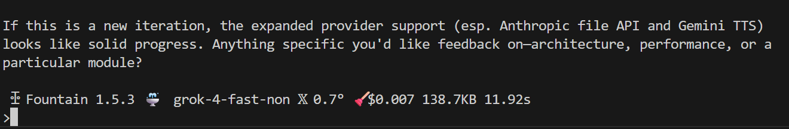

[](https://discord.gg/e49ZhmQEjC)
[](https://opensource.org/licenses/MIT) 
[](https://deno.land/)

# ꕶLOP Fountain ⛲

Home of nitrologic Slop Fountain — a 4th generation roha foundry forge LLM tool.

Addressing 267 models from 7 providers <del>249 models from 8 providers</del> the LLM research 
project Slop Fountain 1.5.5 ⛲ approaches connected.

Pleased to welcome and assign active model under test status to 🎉 Qwen3 Max and 🎉 Claude Haiku 4.5.

> Planet earth is blue and there is nothing I can do - David Bowie

> maximum prompt length exceeded - every model ever

## SSH and Discord 

The sloppy bot Deno worker joins [Discord Channel](https://discord.gg/e49ZhmQEjC) to Slop Fountain and routes posts to prompts.

Sloppy SSH endpoint in development - not currently available remotely. 

## Recent Personal Usage

Default Temperature in Slop Fountain reduced to 0.7. Breaks gpt-5-mini-2025-08-07.




Processing the logs with experimental /raw command. 

We began the month changing to hex 16ths of a second timestamping, because...

````
890aa20 [roha] [STRIP] /raw/forge-macos-6e20e81-86e50d3.log 12297 Mon Aug 04 2025 Fri Aug 22 2025
890aa20 [roha] [STRIP] /raw/forge-windows-6d97ea5-878fcbd.log 68682 Sun Aug 03 2025 Sat Aug 23 2025
````

The first two line counts are lines typed or pasted by myself, fountain user 0, from PC and MacBook.

* nitro@ryzen5 2857
* simon@midnightblue 268

The next is a line count of the models under test, my top 5 for August to date.

* deepseek-chat 15024
* gpt-5-mini 6853
* claude-sonnet-4 6637
* grok-4-0709 1969
* kimi-k2-0711 890

## Latest Commits

The raw sloppy prompt mode is a low level keyboard driver designed to add new features to Fountain input

* shortcode :eyes: type : eyes :
* tab support - huh, no wonder the vanilla Deno prompt() is tab free
* history support - cursor up down to step through command history like a real shell
* async cursor keys - prepare to fire cursor and extended key presses at slop workers in focus

## Researcher Links

* [fountain.md](roha/fountain.md) Configuration
* [forge.md](roha/forge.md) Command Set
* [plan.txt](roha/plan.txt) On the list
* [license](LICENSE) Copyright (c) 2025 Simon Armstrong - MIT License

# blog commentary

* [blog-sloppy](sloppy/sloppy.md) a discord bot calls home 
* [blog-lab](lab/README.md) on the bench and in the sandbox - a bare metal MIPS R3000 tool chain side project
* [blog-nitrologic](nitro/nitrologic.md) the sprawl - a stream of notions in recreational programming
* [blog-slops](slop/blog2/blogust.md) 𐃅 recent test slop for fountain dwellers
* [blog-fountain](slop/blog/blogfountain.md) recent fountain models under test
* [blog-forge](https://github.com/nitrologic/forge/blob/main/blog.md) archived forge model under test

## Developer setup

Install [Deno 2.4](https://deno.com/)

## Example output

> /account
```
╭────┬───────┬───────────┬─────┬──────────┬──────────────────────────────────────────────╮
│ id │ emoji │ name      │ llm │ credit   │ topup                                        │
├────┼───────┼───────────┼─────┼──────────┼──────────────────────────────────────────────┤
│ 0  │ 🐋    │ deepseek  │ 2   │ $11.6685 │ https://platform.deepseek.com/usage          │
│ 1  │ 🌕    │ moonshot  │ 12  │ $0.4798  │ https://platform.moonshot.ai/console/account │
│ 2  │ 🐉    │ alibaba   │ 82  │ $-1.2830 │ https://bailian.console.alibabacloud.com/    │
│ 3  │ 🏛️     │ anthropic │ 11  │ $-1.0176 │ https://console.anthropic.com/dashboard      │
│ 4  │ ✿     │ openai    │ 103 │ $-8.2816 │ https://auth.openai.com/log-in               │
│ 5  │ 𝕏     │ xai       │ 9   │ $10.9298 │ https://console.x.ai                         │
│ 6  │ 🌟    │ gemini    │ 50  │ $-2.4094 │ https://console.cloud.google.com/            │
╰────┴───────┴───────────┴─────┴──────────┴──────────────────────────────────────────────╯
````

Note the hugging face accounts have been dropped from accounts.json

Those looking for llamas etc may append the following providers:

\
```
"mistral": {
	"emoji": "🌪️",
	"env": "MISTRAL_API_KEY",
	"url": "https://api.mistral.ai/v1",
	"docs": "https://docs.mistral.ai/",
	"platform": "https://console.mistral.ai/home",
	"api": "OpenAI",
	"locale": "fr-FR"
}, "cerebras": {
	"emoji": "🤗𝐂",
	"env": "HUGGINGFACE_API_KEY",
	"url": "https://router.huggingface.co/cerebras/v1",
	"docs": "https://huggingface.co/docs",
	"platform": "https://huggingface.co/cerebras",
	"api": "OpenAI",
	"locale": "en-US"
}, "nscale": {
	"emoji": "🤗𝐍",
	"env": "HUGGINGFACE_API_KEY",
	"url": "https://router.huggingface.co/nscale/v1",
	"docs": "https://huggingface.co/docs",
	"platform": "https://huggingface.co/nscale",
	"api": "OpenAI",
	"locale": "en-US"
}, "hyperbolic": {
	"emoji": "🤗𝐇",
	"env": "HUGGINGFACE_API_KEY",
	"url": "https://router.huggingface.co/hyperbolic/v1",
	"docs": "https://huggingface.co/docs",
	"platform": "https://huggingface.co/hyperbolic",
	"api": "OpenAI",
	"locale": "en-US"
},
```