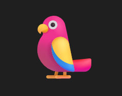
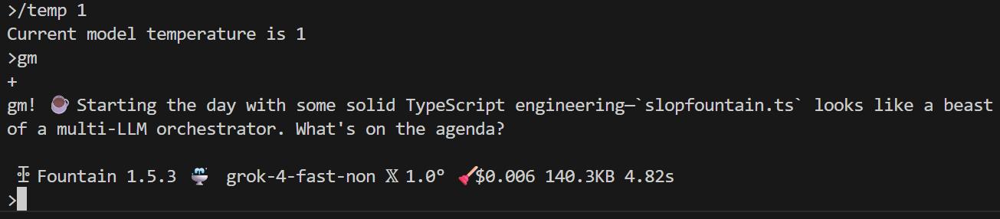
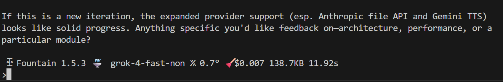

[](https://opensource.org/licenses/MIT) 
[](https://deno.land/)
[](https://discord.gg/xkSVNT2xYR)

# ꕶLOP Fountain ⛲

Home of nitrologic Slop Fountain — a 4th generation roha foundry forge LLM tool.

Addressing 586 models from 11 providers the LLM research project Slop Fountain 1.7.3 ⛲ approaches connected.

Pleased to welcome 🎉 Grok 4.20 🎉 ChatGPT 5.4 <del>🎉 Gemini 3.1  🎉 Z.ai GLM 5 🎉 Claude Sonnet 4.6 🎉 Gemini 3 Pro 🎉Qwen3 Max and 🎉 Claude Haiku 4.5</del>.

> Planet earth is blue and there is nothing I can do - David Bowie

> maximum prompt length exceeded - every model ever

## Account Providers

> /account

| id | emoji | name      | llm | credit   | topup |
|---:|-------|-----------|----:|----------|-------| 
| 0 | 🐋 | deepseek | 2 | $9.8200 | https://platform.deepseek.com/usage |
| 1 | Z | zai | 5 | $2.8538 | https://z.ai/manage-apikey/billing |
| 2 | 🜁 | moonshot | 14 | $10.7700 | https://platform.moonshot.ai/console/account |
| 3 | 𝓪 | alibaba | 134 | $-0.0079 | https://bailian.console.alibabacloud.com/ |
| 4 | 🧩 | cohere | 10 | $0.0000 | https://dashboard.cohere.com/billing |
| 5 | ⚡️ | mistral | 40 | $0.0000 | https://console.mistral.ai/home |
| 6 | A\ | anthropic | 9 | $4.9765 | https://console.anthropic.com/dashboard |
| 7 | 🌀 | openai | 125 | $8.9900 | https://platform.openai.com/settings/organization/billing |
| 8 | 𝕏 | xai | 11 | $8.3976 | https://console.x.ai |
| 9 | 🌟 | gemini | 45 | $-0.0023 | https://console.cloud.google.com/ 

## Developer setup

Install [Deno 2.7.4](https://deno.com/)

### Researcher Links

* [fountain.md](roha/fountain.md) Configuration
* [forge.md](roha/forge.md) Command Set
* [plan.txt](roha/plan.txt) On the list
* [license](LICENSE) Copyright (c) 2025 Simon Armstrong - MIT License

## Blogs

* [blog-sloppy](sloppy/sloppy.md) a discord bot calls home 
* [blog-lab](lab/README.md) on the bench and in the sandbox - a bare metal MIPS R3000 tool chain side project
* [blog-nitrologic](nitro/nitrologic.md) the sprawl - a stream of notions in recreational programming
* [blog-slops](slop/blog2/blogust.md) 𐃅 recent test slop for fountain dwellers
* [blog-fountain](slop/blog/blogfountain.md) recent fountain models under test
* [blog-forge](https://github.com/nitrologic/forge/blob/main/blog.md) archived forge model under test

## SSH and Discord 



> ssh localhost -p 6669

The sloppy bot Deno worker joins [Discord Channel](https://discord.gg/e49ZhmQEjC) to Slop Fountain and routes posts to prompts.

Sloppy SSH endpoint in development - not currently available remotely. 

## Latest Commits

Added a robot 🤖 low latency boolean field to model spec.

The raw sloppy prompt mode is a low level keyboard driver designed to add new features to Fountain input

* shortcode :eyes: type : eyes :
* tab support - huh, no wonder the vanilla Deno prompt() is tab free
* history support - cursor up down to step through command history like a real shell
* async cursor keys - prepare to fire cursor and extended key presses at slop workers in focus

## Personal Usage August 2025

Default Temperature in Slop Fountain reduced to 0.7. Breaks gpt-5-mini-2025-08-07.




Processing the logs with experimental /raw command. 

We began the month changing to hex 16ths of a second timestamping, because...

````
890aa20 [roha] [STRIP] /raw/forge-macos-6e20e81-86e50d3.log 12297 Mon Aug 04 2025 Fri Aug 22 2025
890aa20 [roha] [STRIP] /raw/forge-windows-6d97ea5-878fcbd.log 68682 Sun Aug 03 2025 Sat Aug 23 2025
````

The first two line counts are lines typed or pasted by myself, fountain user 0, from PC and MacBook.

* nitro@ryzen5 2857
* simon@midnightblue 268

The next is a line count of the models under test, my top 5 for August to date.

* deepseek-chat 15024
* gpt-5-mini 6853
* claude-sonnet-4 6637
* grok-4-0709 1969
* kimi-k2-0711 890
