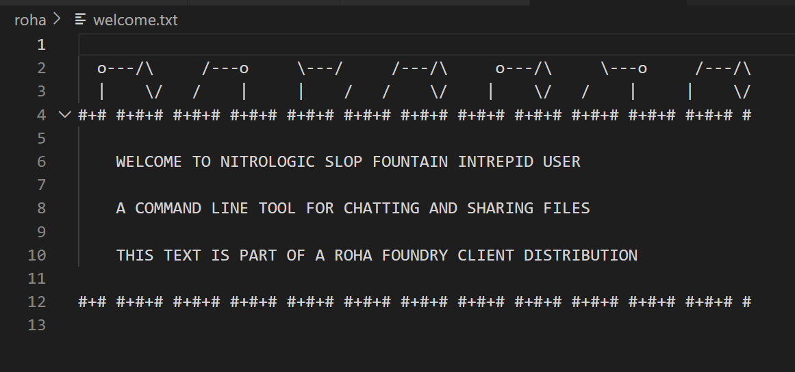

# models under test

[<= previous](https://github.com/nitrologic/forge/blob/main/blog.md)

## yet another new name

## log of recent code review with DeepSeek and grok-3-mini

## deno projects -wired make node.js -tired

## latest Gemini GoogleGenerativeAI driver

## history command added

