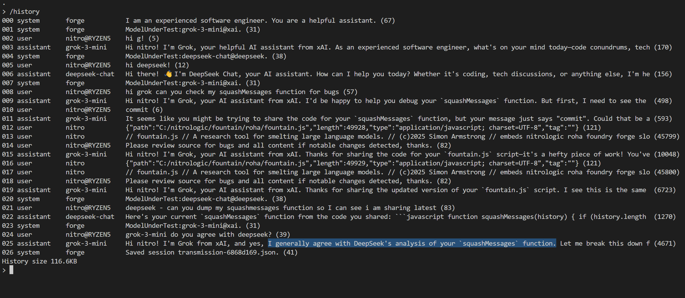
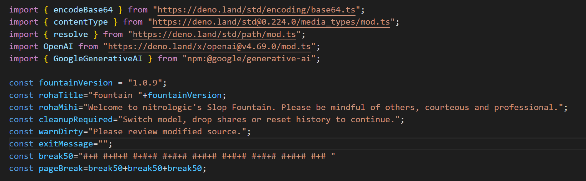
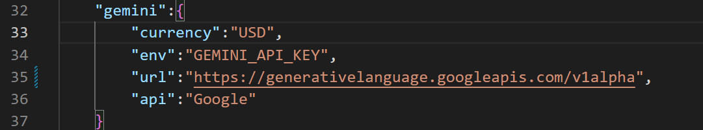
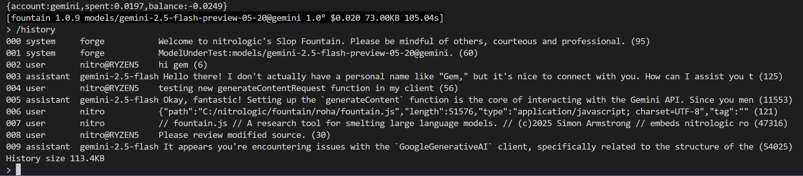
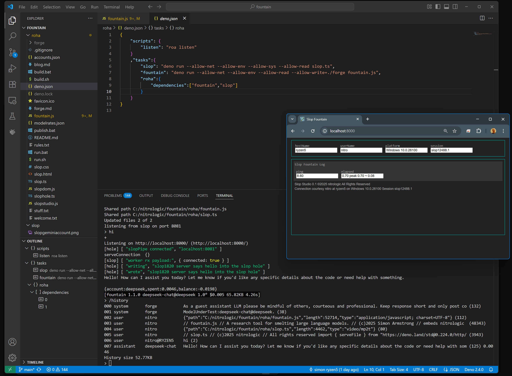

# blog fountain  𓄵𓄲𓄲𓄷𓄲 ⛲

## log of recent code review with DeepSeek and grok-3-mini

## js server platforms? deno -wired | node.js -tired

## latest Gemini GoogleGenerativeAI driver

## unicode under test 𓏍 𓏍

small jar big jar round jar three jars
# 𓏊 𓏋 𓏌 𓏍

## history command added

## serving slopstudio step 1

---

[<= model under test](https://github.com/nitrologic/forge/blob/main/blog.md)
