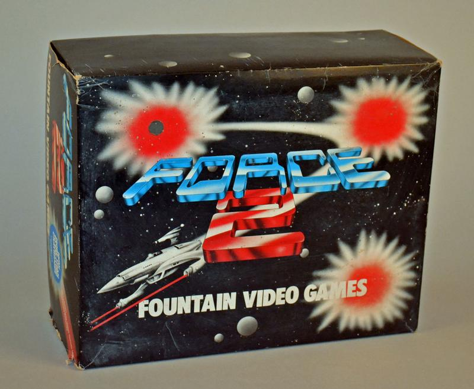
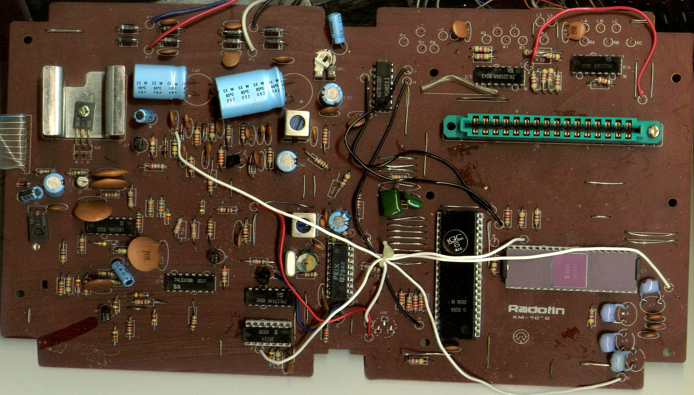
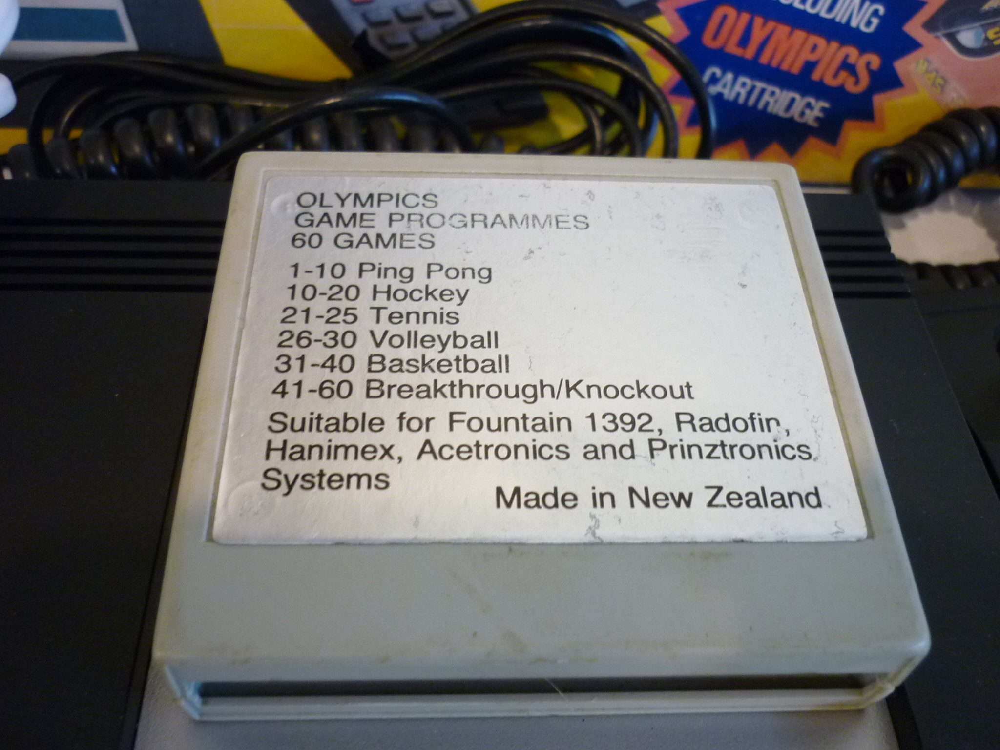

# Force 2

## Socialist countries of the world - Do It Yourself

What ever was in the local water that induced Rewi Alley into a catalyst for modern China
so was the socialist trade protections that allowed kiwi amplifier manufactures such as 
Fountain, Jansen and Holden 

Audio electronics manufacturers protected to employ solder and smelt the warmest amplifiers
on stages and living rooms across the land, also introduce the nation's television to the
nascent technology of video games.

Soldered, tested and proudly manufactured in New Lynn, Parori...

## The Fountain Video Game System

 

* Force 2 - Fountain Video Games
* Production date 1984

## 60 Games

Olympics 60 Games Cartridge - Made in New Zealand

 

## 1292 APVS spec

Specifications

* CPU: 8-bit Signetics 2650AI at 0.887 MHz
* Video: Signetics 2636N at 3.58 MHz. 
* Data: 43 bytes
* Sprites: 4 single colour sprites (1 can be 8 colours)
* Text: 1 score line displaying 4 BCD digits
* Background: series of alternating lines
* Cartridge - 2 KB ROM
* Very basic arcade machine sound

## links

[Museum of Transport and Technology](https://collection.motat.nz/objects/90488/game-console-force-2-fountain-video-games)

[Recent TradeMe listing](https://www.trademe.co.nz/a/marketplace/gaming/other/listing/5673098294)

[Radofin 1292 Design](https://en.wikipedia.org/wiki/1292_Advanced_Programmable_Video_System)
