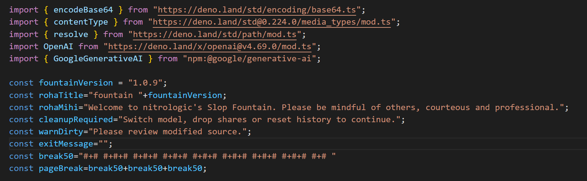

# blog fountain ⛲

# 𓄷𓄲𓄲 𓄵𓄲𓄲𓄷𓄲 

## log of recent code review with DeepSeek and grok-3-mini

## js server platforms? deno -wired | node.js -tired

## latest Gemini GoogleGenerativeAI driver

## unicode under test 𓏍 𓏍

small jar big jar round jar three jars
# 𓏊 𓏋 𓏌 𓏍

## history command added

## serving slopstudio step 1

