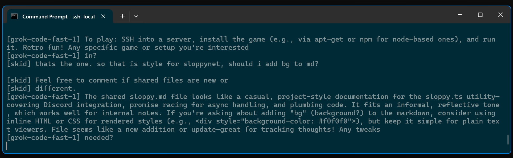

# code under observation


## SSH

With Discord firing on all cylinders we ditch the old telnet code in favor of SSH2
connections where unicode and other mod cons are standard.

Security is the name of the game with ssh.

Viewers at home will notice

* ssh-keygen instructions
* hardcoded use of said keys generated
* a password checker from narnia

### ssh localhost



### sloppynet.ts

```
// sloppynet.ts - a sloppy server for Slop Fountain
// Copyright (c) 2025 Simon Armstrong

// Licensed under the MIT License - See LICENSE file

// ssh-keygen -t rsa -f hostkey_rsa -N ''.

import { Client, Server } from "npm:ssh2";
import { readFileSync } from "node:fs";

import {onSystem,readSystem,readFountain,writeFountain,disconnectFountain,connectFountain} from "./sloppyutils.ts";

const sloppyLogo="✴ slopspace";
const sloppyNetVersion=0.4;

// TODO: make multi planetary

const rsaPath="C:/Users/nitro/.ssh/id_rsa";

// sloppyNet uses slopfeed workers in a responsible manner

const sshClient=new Client();
const sshStreams=[]; // {stream,from}

let slopPail:unknown[]=[];

let sessionCount=0;
let connectionCount=0;
let connectionClosed=0;

const greetings=["Welcome to",sloppyLogo,sloppyNetVersion,"shutdown to quit"].join();

function logSlop(_result:any) {
	const message=JSON.stringify(_result);
	console.error("\t[SLOPPYNET]",message);
	slopPail.push(message);
}

async function sleep(ms:number) {
	await new Promise(function(resolve) {setTimeout(resolve,ms);});
}

async function writeSloppy(message:string,from:string){
	const text="["+from+"] "+message+"\r\n";
	console.log("[SLOP]",text);
	for(const {stream,name} of sshStreams){
		await stream.write(text);
	}
}

let lineBuffer="";

async function onShell(data: Buffer, stream: any, name:string) {
	for (const byte of data) {
		const char = String.fromCharCode(byte);
		if (char === "\n" || char === "\r") {
			if (lineBuffer === "exit") {
				stream.end("Goodbye!\r\n");
				sshClient.end();
				return;
			}
			if (lineBuffer) {
				const line=lineBuffer;
				lineBuffer = "";
				stream.write("\r\n");
				if(!line.startsWith("/")){
					const packet="messages:"
					await writeFountain(line);
					const blob={messages:[{message:line,from:name}]};
					await writeFountain(JSON.stringify(blob,null,0));
				}
			}
		} else {
			// Accumulate non-newline characters
			lineBuffer += char;
			stream.write(char);
		}
	}
}

export async function onFountain(message:string){
	const line=message;
	if(line.startsWith("/announce ")){
		const message=line.substring(10);
		await writeSloppy(message,"fountain");
	}
	if(line.startsWith("{")||line.startsWith("[")){
		try{
			let cursor=0;
			while(cursor<line.length){
				const delim=line.indexOf("}\t{",cursor);// less than healthy
				const json=(delim==-1)?line.substring(cursor):line.substring(cursor,delim+1);
				cursor+=json.length;
				const payload=JSON.parse(json);
				for(const {message,from} of payload.messages){
					await writeSloppy(message,from);
				}
			}
		}catch(error){
			console.log("JSON parse error",error);
			console.log("JSON parse error",line);
		}
	}else{
		console.log("non json line",line);
	}
}

// slopfountain connection

// Creating a basic worker (main.ts)
let worker:Worker | null=new Worker(new URL("./slopfeed.ts",import.meta.url).href,{type:"module"});

function closeSlopHole(){
	if (worker) {
		worker.postMessage({command:"close"});
	}
}

function writeSlopHole(content:string){
	if (worker) {
		worker.postMessage({command:"write",data:{slop:[content]}});
	}
}

function readSlopHole(){
	if (worker) {
		worker.postMessage({command:"read",data:{}});
	}
}

if (worker) {
	worker.onmessage=(message) => {
		const payload=message.data;
		logSlop(payload);
		if(payload.connected){
			writeSlopHole(greetings);
			readSlopHole();
		}
		if(payload.disconnected){
			if (worker) {
				worker.terminate();
				worker=null;
			}
		}
		if(payload.received){
			const rx=payload.received;
			logSlop(rx);
 			onReceive(rx);
		}
	};

	worker.onerror=(e) => {
		console.error("Worker error:",e.message);
	};
}

await sleep(6e3);

if (worker) {
	worker.postMessage({command:"open",data:[5,6,7,8]});
}

// sloppy server

async function onSSHConnection(sshClient: any, name:string) {

	sshClient.on("authentication", (ctx: any) => {
		if (ctx.method === "password") {
			// if (ctx.username!="nitro") ctx.reject();
			ctx.accept();
		} else {
			ctx.reject(); // Reject other authentication methods
		}
	});

	sshClient.on("ready", () => {
		logSlop({ status: "SSH client authenticated" });
		sshClient.on("session", (accept: any, reject: any) => {
			const session = accept();
			session.on("pty", (accept: any) => accept && accept());
			session.on("shell", (accept: any) => {
				const stream = accept();
				sshStreams.push({stream,name});
				stream.write(greetings+"\r\n");
				stream.on("data", (data: Buffer) => {
					onShell(data,stream,name);
				});
			});
		});
	});

	sshClient.on("error", (err: any) => {
		logSlop({ error: "SSH client error", message: err.message });
	});

	sshClient.on("end", () => {
		logSlop({ status: "SSH connection closed" });
	});
}

async function startSSHServer(port: number = 22) {
	try {
		const hostKey = readFileSync(rsaPath, "utf8");
		const server = new Server({ hostKeys: [hostKey] });
		server.on("connection", (sshClient) => {
			const name="com"+(++connectionCount);
			logSlop({ status: "New SSH connection opened", connectionCount });
			onSSHConnection(sshClient,name).catch((err) => {
				logSlop({ error: "Connection error", message: err.message, connectionCount });
			});
		});
		await new Promise((resolve) => server.listen(port, "localhost", () => resolve(undefined)));
		logSlop({ status: "SSH server listening", port });
	} catch (error) {
		console.error("Failed to start SSH server:", error);
	}
}

startSSHServer();

try {
	await connectFountain();
	writeFountain('{"action":"connect"}');
	let portPromise=readFountain();
	let systemPromise=readSystem();

	while(true){
		const race=[portPromise,systemPromise];
		const result=await Promise.race(race);
		if (result == null) break;

		if(result.system) {
			await onSystem(result.system);
			systemPromise=readSystem();
		}
		if(result.message) {
			await onFountain(result.message);
			portPromise=readFountain();
		}
		await sleep(500);
	}
} catch (error) {
	console.error("Error in main loop:",error);
} finally {
	console.log("bye");
	disconnectFountain();
	Deno.exit(0);
}
```


## Discord 

It was discord week

In a newly created root of fountain sloppy is this morning 200 lines of deno.

### sloppy.ts code review of a rapidly growing deno utility 

August 2025 was going to be private repos with venture capital pitch decks flowing with enthusiasm.

Huh.

Instead the path of least resistance lays down for the keep it simple stupids and preambles with MIT license move us along.

```
// sloppy.ts - a research tool connecting large language models and tiny humans
// Copyright (c) 2025 Simon Armstrong
// Licensed under the MIT License

import { Client, GatewayIntentBits } from "npm:discord.js@14.14.1";

const quotes=[
	"🤖 I am sloppy the janitor",
	"did thing thing call for a plunge? 🪠",
	"frump system prompt you say?"
];
````

## the promise race

As we progress into more complex connections in software development, we typically encounter the race condition.

POSIX programmers will know it as the select statement.

https://man7.org/linux/man-pages/man2/select.2.html

In modern javascript I now know it as the promise race.

Here is the main loop of our discord spawning command line utility.

```
let portPromise=readFountain();
let systemPromise=readSystem();
while(true){
	const race=[portPromise,systemPromise];
	const result=await Promise.race(race);
	if (result==null) break;
	if(result.system) {
		onSystem(result.system);
		systemPromise=readSystem();
	}
	if(result.message) {
		onResult(result.message);
		portPromise=readFountain();		
	}
//	echo("result",result);
	await(sleep(500));
}
```

There is alternative ways to service each service. 

Matching the contents of the payload returned by the async function yet to pass the smell test.

As an amateur who has only typed await Promise.race very recently this is all of course a learning journey, not an exercise in best practice carry on.

Having a stack of functions that are all racing to deliver cargo can get very hairy. 

Mad hatter v8 says:

```
<--- Last few GCs --->

[604:000001A87A0BC000]    35175 ms: Scavenge (during sweeping) 4077.9 (4090.8) -> 4074.9 (4093.6) MB, pooled: 0.0 MB, 10.14 / 0.00 ms (average mu = 0.267, current mu = 0.227) allocation failure;
[604:000001A87A0BC000]    36394 ms: Mark-Compact (reduce) 4080.9 (4093.8) -> 4077.3 (4082.3) MB, pooled: 0.0 MB, 541.83 / 0.00 ms (+ 478.3 ms in 96 steps since start of marking, biggest step 5.0 ms, walltime since start of marking 1088 ms) (average mu = 0


#
# Fatal JavaScript out of memory: Ineffective mark-compacts near heap limit
#
==== C stack trace ===============================

        CrashForExceptionInNonABICompliantCodeRange [0x0x7ff6d791ae2b+1625755]
        node_api_get_module_file_name [0x0x7ff6d757ee97+22176951]
        node_api_get_module_file_name [0x0x7ff6d75af9da+22376442]
        node_api_get_module_file_name [0x0x7ff6d755ad3a+22029146]
        node_api_get_module_file_name [0x0x7ff6d7611b27+22778183]
        node_api_get_module_file_name [0x0x7ff6d761596a+22794122]
        node_api_get_module_file_name [0x0x7ff6d76252c7+22857959]
        node_api_get_module_file_name [0x0x7ff6d7624a6b+22855819]
        aws_lc_0_26_0_BIO_hexdump [0x0x7ff6d8f00e5d+1218797]
        node_api_get_module_file_name [0x0x7ff6d760f3eb+22768139]
        CrashForExceptionInNonABICompliantCodeRange [0x0x7ff6d78da510+1361280]
        CrashForExceptionInNonABICompliantCodeRange [0x0x7ff6d80fd47c+9893100]
        (No symbol) [0x0x1a81fe7783a]
```


## Fountain plumbing

This fat patch of interface has been given notice.

Glad it works. :whew:.

```
// fountain connection goes PEEP

function echo(...data: any[]){
	console.error("[PEEP]",data);
}

const encoder = new TextEncoder();
async function writeFountain(message:string){
	if(!slopPipe) return;
	const data=encoder.encode(message);	
	let offset = 0;
//	echo("writing",message);
	while (offset < data.length) {
		const written = await slopPipe.write(data.subarray(offset));
		offset += written;
	}
	echo("wrote",message);
}

const rxBufferSize=1e6;
const rxBuffer = new Uint8Array(rxBufferSize);

let slopPipe:Deno.Conn;

async function connectFountain():Promise<boolean>{
	try{
		slopPipe = await Deno.connect({hostname:"localhost",port:8081});
		echo("connected","localhost:8081");
		return true;
	}catch(error){
		if (error instanceof Deno.errors.ConnectionRefused) {
			echo("Connection Refused",error.message);
		}else{
			const message=JSON.stringify(error);
			echo("Connection Error",message);
		}
	}
	return false;
}

function disconnectFountain(){
	if(!slopPipe) return false;
	slopPipe.close();
	echo("Disconnected");
	slopPipe=null;
	return true;
}

let readingSlop:bool=false;
const fountainDecoder = new TextDecoder();
async function readFountain(){
	if(!slopPipe) return;
	readingSlop=true;
	let n=null;
	try{
		n = await slopPipe.read(rxBuffer);
	}catch(e){
		echo("readFountain",e);
	}
	readingSlop=false;
	if (n == null) {
		const disconnected=disconnectFountain();
		return null;
	}else{
		const received = rxBuffer.subarray(0, n);
		const message = fountainDecoder.decode(received);
		return {message};
	}
}
```
